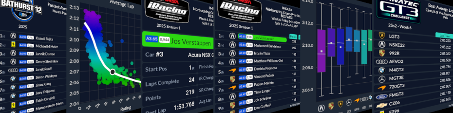

# iRacing Reports Discord Bot

Serve official iRacing series updates, stat cards, and live results straight to your Discord channels. The iRacing Reports bot keeps drivers and teams informed in real time using the same data that powers https://iracingreports.com. We focus exclusively on official races—no league session noise, ever.

## Why Teams Love It
- Live race alerts and podium recaps land in-channel within seconds of official results posting.
- Gorgeous stat cards and comparison charts help drivers and spotters prep for every stint.

## Get Started Fast
1. Visit https://discordbot.iracingreports.com for the onboarding walkthrough.
2. Connect your Discord server, authorize the bot, and follow the official series you care about.

## Rapid Insights for Official Racing
- `/driver` delivers season snapshots for any iRacing member, including splits, positions, and strength of field.
- `/laps` renders pace charts and stint comparisons from the latest official sessions.
- `/balance` highlights car and track trends, helping teams prep for the next week.
- The full command reference stays current at https://discordbot.iracingreports.com/commands.

